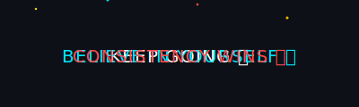

<h1 align="center">
  
</h1>

  
  

<h1 align="center">
  
</h1>

<h3 align="center">
  
</h3>

  
<h1 align="center">👾 My Coding Room</h1>

  

  

---

### 👨‍💻 About Me
- 🌱 Currently learning **Web Dev, DSA & UI/UX — building, solving, and designing every day**
- ⚡ Exploring **Frontend + Backend (MERN soon 🚀)**
- 📫 Reach me at **krvivekkumar121@gmail.com**  
- 🎯 Goal: Build **impactful projects & contribute to open source** 

---

### 🌐 Connect with me:

  
  
  
  

---

### 🛠️ Languages and Tools:

---

### 📊 GitHub Analytics

  

  

  

---

### 🏆 GitHub Trophies

  

---

### 🎨 Contribution Graph

  

---

### 🌀 Fun 3D GitHub Profile

  

  
  

    💻 Dear Developers
  

  

    Slow Progress is Better than No Progress
  

